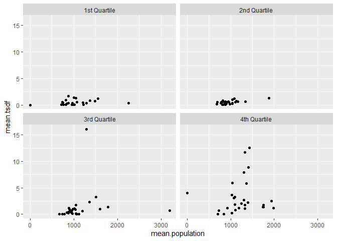
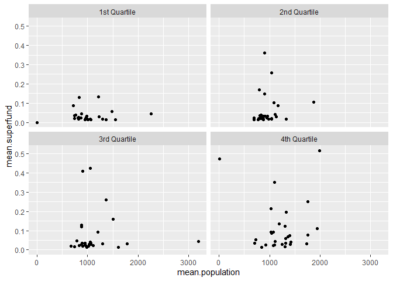
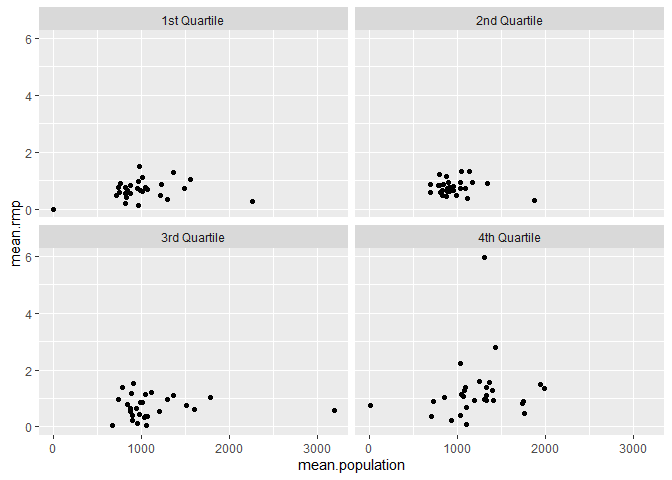
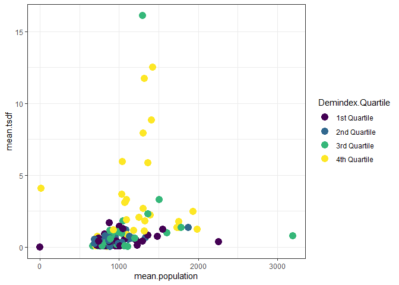
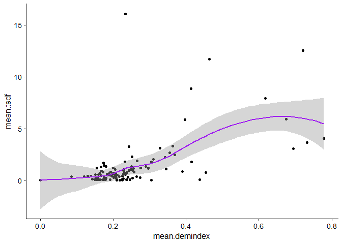
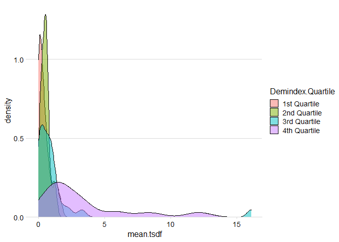
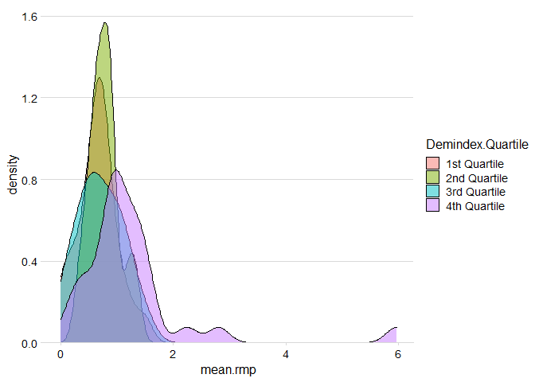
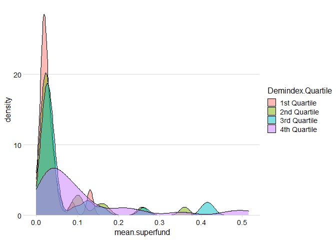

## **Introduction**

*Define the research question or problem you seek to address. What
animated your concern with this research question? What are you
arguing?*

I believe that there is a tendency for companies to place and
governments to approving zoning for pollution-generating facilities.
This is not a novel argument, and I have been passionate about this
concern for a long time. I am particularly concerned about the town
where I grew up in Illinois, so I decided to look at environmental
justice data for the state.

Communities of color, which are often also poor, have historically been
specifically targeted to host facilities that have negative
environmental impacts. I believe that despite our claims as a society to
be champions of equality and justice, there is still that target on both
majority minority communities and low-income communities as compared to
the general population.

## **Data**

*Describe your data source. Why is this an appropriate choice? What are
the variables that you are specifically interested in? Describe those
variables, both numerically and visually.*

**The data I used is from the EPA mapping tool “EJSCREEN”, an
environmental justice screening tool that has mapping functions to see
the locations of pollution and which communities are affected the most
by that pollution.**

The data is gathered from multiple primary sources including the EPA
federal and regional studies, CDC reporting, and state work. The EPA
site allows users to download the dataset in a national summary format
as well as by state, which is the dataset I am using in this analysis.
In order to make the data more manageable, I am focusing only on my
state’s data - Illinois.

From reading the documentation provided with the dataset by the EPA, I
know that the variables consist of both environmental data and
demographic data.

**Environmental Variables**

Environmental variables tracked in this dataset primarily include
calculations representing the proximity of census tracts and population
blocks to certain environmental risks. These risks include sites that
are on the National Priorities List (“Superfund” sites), facilities that
have to file a Risk Management Plan (“RMP”) because they produce toxic
substances or emit toxic byproducts, facilities that are hazardous waste
treatment, storage or disposal sites (“TSDF” sites), levels of diesel
particulate matter in the air, traffic proximity and volume, particulate
matter &lt;2.5, ozone level in air, and index indicators for air toxics
cancer risk, air toxics respiratory hazards, and proximity to major
direct dischargers to water.

I have focused on looking at the first three environmental variables and
named them as:

-   “superfund.area”, the variable indicating the count of proposed and
    listed “Superfund” sites within 5 km of a population, divided by the
    distance away in kilometers.

-   “rmp.area”, the variable indicating the count of facilities that are
    RMP sites within 5 km of a population, divided by the distance away
    in kilometers.

-   “tsdf.area”, the variable indicating the count of facilities that
    are TSDF sites within 5 km of a population, divided by the distance
    away in kilometers.

**Demographic Variables**

Demographic variables tracked in this dataset include the total
population of census tracts and population blocks. In addition, it gives
calculations representing proportional data for each tract or block for
the percentage of: people of color, low-income-defined as no more than
twice the federal poverty level, education below high school, in
linguistic isolation, under age 5, over age 64, and in pre-1960 housing.
There is also a demographic index, which is based on 2 of those factors,
percentage of low-income and people of color.

-   “census.region” is the geographical census tract being measured,
    which can include multiple population blocks being studied by the
    EJSCREEN data.

-   “population” is the count of persons living in the correlating
    census tract.

-   “dem.index” represents a particular census tract’s proportion of
    minority population plus the percentage of low-income population
    divided by 2.

There is a large amount of map color data and map text included in this
dataset. There are multiple location variables primarily divided by a
unique block with defined features by coordinate. These blocks are also
categories by by EPA region, state, and census FIPS code area. I am not
analyzing this additional data in this project.

    ejscreen <- read.delim("../data/EJSCREEN_2020_IL.csv", sep = ",", header  = TRUE)

    ejscreen.tidy <- as_tibble(ejscreen)

**Describing Variables**

I have taken the census region and changed the format to scientific
notation before taking the given variable names and renaming them to
easily identifiable names as listed below. Finally, I group the databy
census tract, and calculate the remaining variables by the mean of the
population blocks I am combining in the process.

-   PNPL = superfund
-   PRMP = rmp.area
-   PTSDF = tsdf.area
-   ID = census.region
-   ACSTOTPOP = population
-   VULEOPCT = dem.index

<!-- -->

    options(scipen = 999)
    (ejscreen.clean <- ejscreen.tidy %>% 
       rename(superfund.area = PNPL,
              rmp.area = PRMP,
              tsdf.area = PTSDF,
              census.region = ID,
              population = ACSTOTPOP, 
              dem.index = VULEOPCT) %>% 
       select(superfund.area, rmp.area, tsdf.area,  census.region, population, dem.index))

    ## # A tibble: 9,691 x 6
    ##    superfund.area rmp.area tsdf.area census.region population dem.index
    ##             <dbl>    <dbl>     <dbl>         <dbl>      <int>     <dbl>
    ##  1         0.0436    2.79      31.2   170313000000       1964     0.239
    ##  2         0.0306    1.28       8.24  170312000000        968     0.373
    ##  3         0.0384    1.88      28.5   170318000000       1371     0.272
    ##  4         0.0532    4.81       9.31  170313000000       2031     0.728
    ##  5         0.0305    2.63       7.90  170312000000        576     0.248
    ##  6         0.0431    2.91      40.4   170313000000       2446     0.491
    ##  7         0.0398    2.72      28.7   170312000000       1181     0.536
    ##  8         0.0326    0.872     12.8   170312000000       2223     0.530
    ##  9         0.0350    2.22      20.9   170318000000        620     0.161
    ## 10         0.0309    1.17       8.44  170312000000       1026     0.335
    ## # ... with 9,681 more rows

    ejscreen.mean <- ejscreen.clean %>%
      group_by(census.region) %>%
      summarise(mean.rmp = mean(rmp.area), 
                mean.superfund = mean(superfund.area),
                mean.tsdf = mean(tsdf.area),
                mean.demindex = mean(dem.index),
                mean.population = mean(population))
    ejscreen.mean

    ## # A tibble: 114 x 6
    ##    census.region mean.rmp mean.superfund mean.tsdf mean.demindex mean.population
    ##            <dbl>    <dbl>          <dbl>     <dbl>         <dbl>           <dbl>
    ##  1  170010000000    0.743         0.103     1.18           0.201           1089.
    ##  2  170040000000    0.909         0.0521    0.742          0.454            726.
    ##  3  170060000000    0.363         0.0423    0.499          0.211           1114.
    ##  4  170070000000    1.37          0.516     1.22           0.296           1985.
    ##  5  170100000000    1.21          0.0225    0.0252         0.218           1112.
    ##  6  170120000000    0.753         0.149     0.219          0.209            902.
    ##  7  170140000000    0.136         0.0254    0.0461         0.165            972.
    ##  8  170160000000    0.582         0.0359    0.0568         0.179            809 
    ##  9  170180000000    1.05          0.0130    0.0345         0.304            844.
    ## 10  170190000000    1.28          0.0752    2.23           0.342           1396.
    ## # ... with 104 more rows

**Analyzing the Relationships Between Variables**

I can create a correlation matrix that gives an overview of the
correlations for all combinations of two variables, rounded to 2
decimals. This argument produces Pearson correlations by default.

    round(cor(ejscreen.mean),
      digits = 2 
    )

    ##                 census.region mean.rmp mean.superfund mean.tsdf mean.demindex
    ## census.region            1.00    -0.17          -0.03     -0.23         -0.12
    ## mean.rmp                -0.17     1.00           0.15      0.47          0.51
    ## mean.superfund          -0.03     0.15           1.00      0.11          0.32
    ## mean.tsdf               -0.23     0.47           0.11      1.00          0.57
    ## mean.demindex           -0.12     0.51           0.32      0.57          1.00
    ## mean.population         -0.05     0.18           0.09      0.22          0.11
    ##                 mean.population
    ## census.region             -0.05
    ## mean.rmp                   0.18
    ## mean.superfund             0.09
    ## mean.tsdf                  0.22
    ## mean.demindex              0.11
    ## mean.population            1.00

After analyzing the Pearson correlations, I can see that there are some
relationships with stronger positive linear relationships than others.
Those moderately strong positive correlations (0.51 to 0.7) are:

-   Mean Demographic Index to Mean RMP Area Frequency
-   Mean Demographic Index to Mean TSDF Area Frequency

The weak positive correlations (0.3 to 0.5) are:

-   Mean Demographic Index to Mean Superfund Area Frequency
-   Mean TSDF Area Frequency to Mean RMP Area Frequency

**Making a Null and Alternative Hypothesis**

H0: ρ=0 (meaning that there is no linear relationship between the two
variables)

H1: ρ≠0 (meaning that there is a linear relationship between the two
variables)

I used cor.test to determine the p-value to examine the relationships
between the EJSCREEN mean demographic index score for a given census
tract and the mean number of environmental threats in those areas as
measured by the mean count of these sites in the mean.rmp,
mean.superfund and mean.tsdf variables.

I then need to look at the p-values of each relationship in my data set
using the ‘Hmisc package’. This shows each p-value rounded to three
decimals.

    res <- rcorr(as.matrix(ejscreen.mean))
    round(res$P, 3)

    ##                 census.region mean.rmp mean.superfund mean.tsdf mean.demindex
    ## census.region              NA    0.078          0.754     0.013         0.187
    ## mean.rmp                0.078       NA          0.102     0.000         0.000
    ## mean.superfund          0.754    0.102             NA     0.238         0.001
    ## mean.tsdf               0.013    0.000          0.238        NA         0.000
    ## mean.demindex           0.187    0.000          0.001     0.000            NA
    ## mean.population         0.631    0.054          0.353     0.018         0.229
    ##                 mean.population
    ## census.region             0.631
    ## mean.rmp                  0.054
    ## mean.superfund            0.353
    ## mean.tsdf                 0.018
    ## mean.demindex             0.229
    ## mean.population              NA

After analyzing the matrix, it is clear that we do have some
correlations with statistically significant correlations using a
significance level of α=0.05

P-value ≤ α: The correlation is statistically significant

-   P-values for mean.rmp and mean.tsdf
-   P-values for mean.population and mean.tsdf
-   P-values for mean.demindex and mean.rmp, mean.superfund, and
    mean.tsdf

P-value &gt; α: All other non-categorical relationships

**Summary of Initial Variable Analysis**

At first review of my initial statistical analysis of my hypothesis, it
does seem that there are statistically significant, positive
correlations between increasing demographic index ratings and the
frequency of all three environmental risk variables I have examined.

Looking further, the strongest relationships are between the demographic
index ratings and the frequency of TSDF sites and RMP sites within 5 km
of the census region. There is a significant but weaker relationship
between the demographic index ratings and the frequency of the Superfund
sites within 5 km of the census region.

This could be explained logically by the nature of the environmental
risk; Superfund sites are those that have been identified as former
polluting sites that have urgent for remediation, which is more likely
to be in areas where there are fewer vulnerable and low-income
populations and more vocal and high-influence populations demanding
urgency to the remediation.

On the other hand, the TSDF sites (toxic storage and disposal
facilities) and RMP sites (facilities that emit toxic pollutants that
require RMP (risk management plans) on file with the EPA) are those that
are actively operating in vulnerable populations.

    Demindex.Percentile_00 <- min(ejscreen.mean$mean.demindex)
    Demindex.Percentile_25 <- quantile(ejscreen.mean$mean.demindex, 0.25)
    Demindex.Percentile_50 <- quantile(ejscreen.mean$mean.demindex, 0.50)
    Demindex.Percentile_75 <- quantile(ejscreen.mean$mean.demindex, 0.75)
    Demindex.Percentile_100 <- max(ejscreen.mean$mean.demindex)

    RB = rbind(Demindex.Percentile_00, Demindex.Percentile_25, Demindex.Percentile_50, Demindex.Percentile_75, Demindex.Percentile_100)

    dimnames(RB)[[2]] = "Value"

    RB

    ##                             Value
    ## Demindex.Percentile_00  0.0000000
    ## Demindex.Percentile_25  0.1778061
    ## Demindex.Percentile_50  0.2175840
    ## Demindex.Percentile_75  0.2651559
    ## Demindex.Percentile_100 0.7777778

    ejscreen.mean$Demindex.Quartile[ejscreen.mean$mean.demindex >= Demindex.Percentile_00 & ejscreen.mean$mean.demindex <  Demindex.Percentile_25]  = "1st Quartile"

    ## Warning: Unknown or uninitialised column: `Demindex.Quartile`.

    ejscreen.mean$Demindex.Quartile[ejscreen.mean$mean.demindex > Demindex.Percentile_25 & ejscreen.mean$mean.demindex <  Demindex.Percentile_50]  = "2nd Quartile"
    ejscreen.mean$Demindex.Quartile[ejscreen.mean$mean.demindex > Demindex.Percentile_50 & ejscreen.mean$mean.demindex < Demindex.Percentile_75] = "3rd Quartile"
    ejscreen.mean$Demindex.Quartile[ejscreen.mean$mean.demindex > Demindex.Percentile_75 & ejscreen.mean$mean.demindex <=  Demindex.Percentile_100]  = "4th Quartile"

    ejscreen.mean

    ## # A tibble: 114 x 7
    ##    census.region mean.rmp mean.superfund mean.tsdf mean.demindex mean.population
    ##            <dbl>    <dbl>          <dbl>     <dbl>         <dbl>           <dbl>
    ##  1  170010000000    0.743         0.103     1.18           0.201           1089.
    ##  2  170040000000    0.909         0.0521    0.742          0.454            726.
    ##  3  170060000000    0.363         0.0423    0.499          0.211           1114.
    ##  4  170070000000    1.37          0.516     1.22           0.296           1985.
    ##  5  170100000000    1.21          0.0225    0.0252         0.218           1112.
    ##  6  170120000000    0.753         0.149     0.219          0.209            902.
    ##  7  170140000000    0.136         0.0254    0.0461         0.165            972.
    ##  8  170160000000    0.582         0.0359    0.0568         0.179            809 
    ##  9  170180000000    1.05          0.0130    0.0345         0.304            844.
    ## 10  170190000000    1.28          0.0752    2.23           0.342           1396.
    ## # ... with 104 more rows, and 1 more variable: Demindex.Quartile <chr>

## **Visualization**

*Develop a visualization that best addresses your research question.
Describe the visualization in detail. Then, explain what other options
you considered for visualizing the data, and explain why the option you
chose was the best option.*

**Scatterplot 1**

I created a faceted scatterplot showing the mean population of each
census area on the x axis and the mean frequency of each census area for
each environmental risk on the y axis. Each quartile of the demographic
index rating is illustrated independently, showing a visual
acknowledgement of what the statistical analysis showed.

    (ggplot(data = ejscreen.mean) + 
      geom_point(mapping = aes(x = mean.population, y = mean.tsdf)) + 
      facet_wrap(~ Demindex.Quartile, nrow = 2))

    (ggplot(data = ejscreen.mean) + 
      geom_point(mapping = aes(x = mean.population, y = mean.superfund)) + 
      facet_wrap(~ Demindex.Quartile, nrow = 2))

    (ggplot(data = ejscreen.mean) + 
      geom_point(mapping = aes(x = mean.population, y = mean.rmp)) + 
      facet_wrap(~ Demindex.Quartile, nrow = 2))

**Scatterplot 2**

The most significant correlation looks like the relationship between the
mean number of TSDF sites and a higher demographic index. I want to
visualize this differently, so I’m using color to look at the
demographic index quartiles against the scatterplot of population and
mean TSDF sites. It displays a visual representation of how many more
TSDF sites are truly located in the highest minority and low-income
population areas.

    v <- ggplot(ejscreen.mean, aes(mean.population, mean.tsdf))
    v + geom_point(size=4, aes(colour = Demindex.Quartile)) +
        scale_color_viridis(discrete=TRUE) +
        theme_bw()

**Scatterplot 3**

The last scatterplot I tried displays a representation of the mean
population of a census tract and the mean number of TSDF areas with a
line smoothing the points to highlight the trajectory of the data.

    ggplot(ejscreen.mean, aes(x = mean.demindex, y = mean.tsdf)) + 
      geom_point() +
      geom_smooth(color = "purple") +
      theme_half_open(12)

    ## `geom_smooth()` using method = 'loess' and formula 'y ~ x'

**Density Plot**

I also used the package “cowplot” and visualized the Demographic Index
Quartile densities against each of the environmental risk factor
frequencies. This visualization shows relationships between the patterns
graphically well, but primarily, again, for the strongest correlating
variable;the mean TSDF rating and areas in the 4th quartile of the
demographic index.

    ggplot(ejscreen.mean, aes(mean.tsdf, fill = Demindex.Quartile)) + 
      geom_density(alpha = 0.5) +
      scale_y_continuous(expand = expansion(mult = c(0, 0.05))) +
      theme_minimal_hgrid(12)

    ggplot(ejscreen.mean, aes(mean.rmp, fill = Demindex.Quartile)) + 
      geom_density(alpha = 0.5) +
      scale_y_continuous(expand = expansion(mult = c(0, 0.05))) +
      theme_minimal_hgrid(12)

    ggplot(ejscreen.mean, aes(mean.superfund, fill = Demindex.Quartile)) + 
      geom_density(alpha = 0.5) +
      scale_y_continuous(expand = expansion(mult = c(0, 0.05))) +
      theme_minimal_hgrid(12)

**Visualization Choices**

I considered using bar graphs or pie charts, but having two continuous
variables limited what I could demonstrate using them. In order to use a
bar graph, I would need to do something like making them categorial
values to reflect quartiles. I don’t believe that would be as accurate
of a representation as a scatterplot, which captures more points of
data.

## **Reflection**

*Describe your experience with the process. What decisions in your
pipeline are you most concerned about potentially influencing your
findings? What were the most challenging and time-consuming aspects of
the project? What do you wish you had been able to do? If you were to
continue the project, what would your next steps be?*

I found this project engaging and the process somewhat addictive. I
started down more paths than I have documented in this final paper but
have run out of work through them completely. I plan to continue down
those paths as diving into these concepts has been very interesting, and
I am finding myself more and more competent in the language of R.

I am most concerned about my choice in taking the demographic index
score and dividing it into quartiles. If I were to continue the project,
I would definitely work with the variables to interpret more of them
into different categorical units. I would also go back and look at more
variables representing different environmental and demographic data.
Specifically, I wish I had been able to analyze the traffic data. In my
hometown, intermodal centers have taken over the landscape to the point
that the county is now officially the largest inland port in North
America. The intermodal centers take advantage of the county being where
two interstates meet, which is also adjacent to three different rivers
and a major train hub. Unfortunately, most of the residents did not want
any of these intermodal centers to build in the county, but being a low
income area, the residents lacked the power or resources to challenge
the developments. I believe the sharp rise in asthma among area children
could correlate with the increse in diesel truck traffic. There are
limitations to this dataset in making that analysis though, so I would
need to bring in additional data to complete that study.

## **Conclusion**

*Discuss your research question again briefly and state succinctly the
preliminary findings. Also discuss the potential ramifications of action –
or inaction – on this policy.*

There is definitely a statistically significant correlation between
census tracts with the highest proportion of minority and low income
populations as calculated in the demographic index variable and the
environmental risks I analyzed. These preliminary findings lend credence
to the central question of my project, which was whether there is a
tendency for companies to place and governments to approve zoning for
pollution-generating facilities in those vulnerable communities.

## **Bibliography:**

*United States Environmental Protection Agency (EPA), 2020 version,
updated July 1, 2021. EJSCREEN. Retrieved: July 16, 2021
(<https://gaftp.epa.gov/EJSCREEN/2020/>)*
