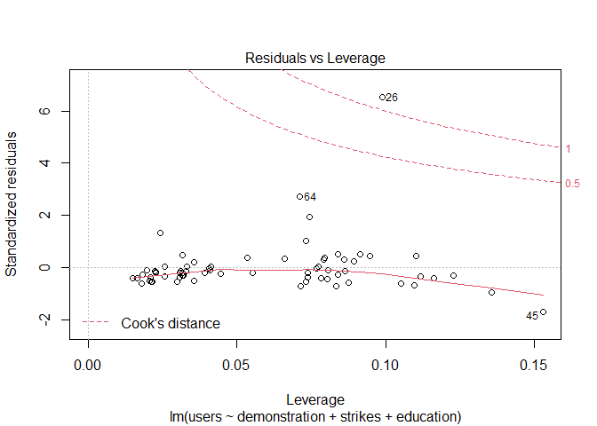

## Commentary

A thorough overview of statistical analysis methods, this course engaged in 
four in-depth assignments involving the use of R to practice regression
analysis. 

The final project asked us to utilize all of the tools we learned through the
semester and apply it to any data set of our choice.

## Poster Presentation

You can check out the final project by clicking [here.](pdfs/603-Research-Poster.pdf)

## Project Data Sources

### DDOS User Observations

The primary data is a set of observations of users of a novice “hacking
tool” to engage in DDOS (denial of service) attacks against Russian
targets in March 2022. The data contains a total of users cumulatively
for each day of the series March 2 through March 11, and the users
represent participants from 98 counties.

### WVS/EVS

I will also be using a data set of observations from the World Values
Survey conducted from 2017-2021 as a joint project between the World
Values Survey and the European Values Studies. This data was released in
July 2021, and contains responses from ~135,000 respondents among 95
countries.

### Spike/Newswhip

The third is a data set of media coverage (media articles and social
media mentions) of the Ukrainian minister’s call for volunteers for the
“IT Army of Ukraine” to help fight the invasion of Russia on the digital
front.

## Data Analysis

### DDOS Users

I moved the data into various forms to best explore ways to analyze it.

### DDOS Daily Observations

-   Country Name
-   Population (as indicated by the U.S. CIA World factbook website)
-   Region (as indicated by the U.S. CIA World factbook website)
-   Columns for each date being observed from March 2 - March 11 of DDOS
    users from each country. This is difficult to use for analysis
    because the daily observations do NOT represent new users added on
    that day; rather, the daily observations represent the cumulative
    users from each country as of that day.

<!-- -->

    #load the data
    ddos_daily <- read_csv("ddos_observations.csv")

    ## 
    ## -- Column specification --------------------------------------------------------
    ## cols(
    ##   country = col_character(),
    ##   population = col_number(),
    ##   region = col_character(),
    ##   `3/2/2022` = col_double(),
    ##   `3/3/2022` = col_double(),
    ##   `3/4/2022` = col_double(),
    ##   `3/5/2022` = col_double(),
    ##   `3/6/2022` = col_double(),
    ##   `3/7/2022` = col_double(),
    ##   `3/8/2022` = col_double(),
    ##   `3/9/2022` = col_double(),
    ##   `3/10/2022` = col_double(),
    ##   `3/11/2022` = col_double()
    ## )

    #assign column names to represent variables accurately
    colnames(ddos_daily) <- c("Country", "Population", "Region", "March2", "March3", "March4", "March5", "March6", "March7", "March8", "March9", "March10", "March11")
    #summarize the data
    options(scipen = 999)
    head(ddos_daily)

    ## # A tibble: 6 x 13
    ##   Country   Population Region   March2 March3 March4 March5 March6 March7 March8
    ##   <chr>          <dbl> <chr>     <dbl>  <dbl>  <dbl>  <dbl>  <dbl>  <dbl>  <dbl>
    ## 1 Aland          29789 Europe        1      1      1      1      1      1      1
    ## 2 Albania      3088385 Europe       19     22     22     23     32     44     51
    ## 3 Algeria     43576691 Africa        0      8      8      8      8      8      8
    ## 4 Andorra        85645 Europe        2      6      6      6      6      6      6
    ## 5 Argentina   45864941 South A~      9      9      9     11     11     11     11
    ## 6 Armenia      3011609 Asia          1      7      7      9      9     13     13
    ## # ... with 3 more variables: March9 <dbl>, March10 <dbl>, March11 <dbl>

The total DDOS users as of the first day of observations, March 2, 2022,
and the last day available for observation, March 11, 2022 began at
7,850 and grew to a total of 48,879.

    sum(ddos_daily$March2)

    ## [1] 7850

    sum(ddos_daily$March11)

    ## [1] 48879

### DDOS Cumulative Observations

However, I am not going to examine the panel data; I am only going to
look at the cumulative data - or the count of users on the last day of
observations, March 11. So this looks at:

-   Country Name
-   Population (as indicated by the U.S. CIA World factbook website)
-   Region (as indicated by the UN classifications)
-   Users of the DDOS tool from each country as of the last day
    observed, March 11

<!-- -->

    #load the data
    ddos_cumulative <- read_csv("ddos_cumulative.csv")

    ## 
    ## -- Column specification --------------------------------------------------------
    ## cols(
    ##   country = col_character(),
    ##   population = col_number(),
    ##   region = col_character(),
    ##   users = col_double()
    ## )

    #summarize the data
    options(scipen = 999)
    head(ddos_cumulative)

    ## # A tibble: 6 x 4
    ##   country   population region        users
    ##   <chr>          <dbl> <chr>         <dbl>
    ## 1 Aland          29789 Europe            1
    ## 2 Albania      3088385 Europe           57
    ## 3 Algeria     43576691 Africa           10
    ## 4 Andorra        85645 Europe            6
    ## 5 Argentina   45864941 South America    11
    ## 6 Armenia      3011609 Asia             16

### DDOS Regional Observations

It is still important to be able to visualize the dramatic change in
user count over time, even if I am not analyzing the time series in this
analysis. I experimented with displaying the increase as a whole and the
increase by region. So this looks at:

-   Date of observations
-   Users of the DDOS tool from each region as of the the given day

<!-- -->

    ddos_regions <- read_csv("ddos_by_region.csv", 
        col_types = cols(Date = col_date(format = "%m/%d/%Y")))
    ddos_regions <- as_tibble(ddos_regions) 
    ddos_regions

    ## # A tibble: 10 x 10
    ##    Date       Africa  Asia Europe Middle_East North_America Oceania
    ##    <date>      <dbl> <dbl>  <dbl>       <dbl>         <dbl>   <dbl>
    ##  1 2022-03-02     15   180   4863          72          1208      90
    ##  2 2022-03-03     32   419   6994         115          1723     119
    ##  3 2022-03-04     39   467   9069         137          1905     135
    ##  4 2022-03-05     59   604  17392         163          2416     177
    ##  5 2022-03-06     77   694  18447         184          2653     195
    ##  6 2022-03-07     88   867  20999         206          3057     245
    ##  7 2022-03-08    129  1143  27081         306          4028     363
    ##  8 2022-03-09    137  1171  27996         320          4245     580
    ##  9 2022-03-10    156  1308  30141         353          4548     623
    ## 10 2022-03-11    164  1443  34439         390          5245     718
    ## # ... with 3 more variables: South_America <dbl>, Southeast_Asia <dbl>,
    ## #   Ukraine <dbl>

    ggplot(ddos_regions, aes(x = Date)) +
      geom_line(aes(y = Africa, colour = "Africa")) +
      geom_line(aes(y = Asia, colour = "Asia")) +
      geom_line(aes(y = Europe, colour = "Europe")) +
      geom_line(aes(y = Middle_East, colour = "Middle East")) +
      geom_line(aes(y = North_America, colour = "North America")) +
      geom_line(aes(y = Oceania, colour = "Oceania")) +
      geom_line(aes(y = South_America, colour = "South America")) +
      geom_line(aes(y = Southeast_Asia, colour = "Southeast Asia")) + 
      geom_line(aes(y = Ukraine, colour = "Ukraine")) +
      scale_colour_discrete((name = "Region")) +
      xlab("Dates") +
      ylab("Users") +
      ggtitle("Increase in Regional Users by Date") +
      theme_minimal()

If we eliminate the most significant location of users (Europe) it is
simply easier to get an idea of how the users from the remaining regions
increased over time.

    ggplot(ddos_regions, aes(x = Date)) +
      geom_line(aes(y = Africa, colour = "Africa")) +
      geom_line(aes(y = Asia, colour = "Asia")) +
      geom_line(aes(y = Middle_East, colour = "Middle East")) +
      geom_line(aes(y = North_America, colour = "North America")) +
      geom_line(aes(y = Oceania, colour = "Oceania")) +
      geom_line(aes(y = South_America, colour = "South America")) +
      geom_line(aes(y = Southeast_Asia, colour = "Southeast Asia")) + 
      geom_line(aes(y = Ukraine, colour = "Ukraine")) +
      scale_colour_discrete((name = "Region")) +
      xlab("Dates") +
      ylab("Users") +
      ggtitle("Increase in Non-European Users by Date") +
      theme_minimal()

And the total users over time.

    ddos_time <- read_csv("daily_observations.csv", 
        col_types = cols(Date = col_date(format = "%m/%d/%Y")))
    ddos_time <- as_tibble(ddos_time) 
    gg <- ggplot(ddos_time, aes(x = Date)) +
      geom_line(aes(y = Total)) +
      xlab("Dates") +
      ylab("Users") +
      ggtitle("Increase in Total Users by Date") +
      theme_minimal()
    gg

### Population & User Data Only

I’ll start with a basic visualization of the relationship between the
population of the countries and the number of users of DDOS attacks from
the corresponding countries:

    #create plot
    ggplot(ddos_cumulative, aes(x = log(population), y = log(users), color = region)) +
      geom_point () +
      facet_wrap("region")

### Linear Model of Population and Users

What I want to look at is the linear model of the relationship between
the population of each country with participating users and the
corresponding sample of users from that country.

I’ll first simplify my data set to only contain the columns I am looking
at here.

    pop_users <- ddos_cumulative %>% 
      select(c(population, users))
    gg1 <- ggplot(pop_users, aes(x=population, y=users)) +
       geom_point() +
       geom_smooth(method=lm,se=TRUE,fullrange=TRUE,color="cornflowerblue") +
       labs(title= "Population and Users",
            x= "Population",
            y = "Users") +
        theme_minimal_hgrid()
    gg1

    ## `geom_smooth()` using formula 'y ~ x'

That’s a mess. I want to take the log() of the data to achieve a better
look at the model

    gg1b <- ggplot(pop_users, aes(x=log(population), y=log(users))) +
      geom_point() +
      geom_smooth(method=lm,se=TRUE,fullrange=TRUE,color="cornflowerblue") +
       labs(title= "Log: Population and Users",
            x= "Population (log)",
            y = "Users (log)") +
       theme_minimal_hgrid()

    gg1b

    ## `geom_smooth()` using formula 'y ~ x'

On first look at this relationship, it seems clear that there is no
correlation between a country’s population and the number of users of
the DDOS tool.

    pop_users_lm <- lm(population~users, data = pop_users)
    summary(pop_users_lm)

    ## 
    ## Call:
    ## lm(formula = population ~ users, data = pop_users)
    ## 
    ## Residuals:
    ##        Min         1Q     Median         3Q        Max 
    ##  -68122950  -59609854  -52417541  -18720617 1334465479 
    ## 
    ## Coefficients:
    ##             Estimate Std. Error t value Pr(>|t|)   
    ## (Intercept) 63129462   21142912   2.986  0.00359 **
    ## users           4092      12789   0.320  0.74972   
    ## ---
    ## Signif. codes:  0 '***' 0.001 '**' 0.01 '*' 0.05 '.' 0.1 ' ' 1
    ## 
    ## Residual standard error: 199600000 on 96 degrees of freedom
    ## Multiple R-squared:  0.001065,   Adjusted R-squared:  -0.009341 
    ## F-statistic: 0.1024 on 1 and 96 DF,  p-value: 0.7497

## IVS Data

The next data source I want to explore is the IVS data set.

### Reading in Data

This brings in an overwhelming 135,000 observations of 231 variables. I
selected the columns I am interested in working with and saved as a .csv
file, which I will read in for the rest of the analysis.

A full accounting of the variables and descriptions are in the “About”
tab of this GitHub Page.

To make matching easier, I used the “countrycode” package to assign
proper country names to the ISO-3 numeric code from the data set.

    #read in .dta file
    #library(haven)
    #ivs_data <- read_dta("data/ivs/ZA7505_v2-0-0.dta")
    #head(ivs_data[33:42])
    #write.csv(ivs_data, file = "./data/ivs/ivs_data.csv", row.names = TRUE)
    #select relevant data
    #ivs_subset <- select(ivs_data,10,34,35,40:50,106,109:114,119:138,150:162,166,188:196,199,201,210:214,222,224,225,230,231)
    #ivs_df <- as.data.frame(ivs_subset)
    #load package for converting country codes
    #library(countrycode)
    #ivs_df$country.name <- countrycode(ivs_df$cntry, origin = "iso3n", destination = "country.name")

    ivs_clean <- read.csv("ivs-df-clean.csv")
    ivs_clean <- as_tibble(ivs_clean)
    names(ivs_clean)[1] <- 'country'
    head(ivs_clean)

    ## # A tibble: 6 x 72
    ##   country weight imp_family imp_friends imp_leisure imp_politics imp_work
    ##   <chr>    <dbl>      <int>       <int>       <int>        <int>    <int>
    ## 1 Albania  0.697          2           1           2            3        2
    ## 2 Albania  0.697          1           1           4            4        1
    ## 3 Albania  0.697          1           2           2            4        1
    ## 4 Albania  0.697          1           2           2            4        1
    ## 5 Albania  0.697          1           1           2            4        1
    ## 6 Albania  0.697          1           3           3            4        1
    ## # ... with 65 more variables: imp_religion <int>, sat_happiness <int>,
    ## #   sat_health <int>, sat_life <int>, sat_control <int>,
    ## #   willingness_fight <int>, interest_politics <int>, prop_petition <int>,
    ## #   prop_boycotts <int>, prop_demonstrations <int>, prop_strikes <int>,
    ## #   self_position <int>, conf_churches <int>, conf_armed <int>,
    ## #   conf_press <int>, conf_unions <int>, conf_police <int>,
    ## #   conf_parliament <int>, conf_civilservices <int>, conf_regional <int>, ...

## Transforming IVS Data

### Preprocessing

In the original data in the IVS datasets, there are some meaningless
choices in the value labels such as “Not asked,” “NA,” and “DK.”
Additionally, some response have negative serial numbers. Furthermore, I
excluded variables that have a response structure that do not follow the
structures that are congruous to the structure of the majority of the
responses.

### Grouping by Mean

There are some changes needed to make the data more manageable. I have
cleaned up some of the data by assigning all negative values
representing various codes for no available observation to “NA” when
applicable. I took means when applicable saved the resulting means by
country as a series of data sets I saved offline that I will import.

### Example of how I manipulated the data before saving:

    #select relevant data
    #ivs_important <- select(ivs_clean,1:8)

    #find mean of each column
    #important <- ivs_important %>%
      #group_by(country) %>%
      #summarise(
        #family = mean(imp_family, na.rm = TRUE),
        #friends = mean(imp_friends, na.rm = TRUE),
        #leisure = mean(imp_leisure, na.rm = TRUE),
        #politics = mean(imp_politics, na.rm = TRUE),
        #work = mean(imp_work, na.rm = TRUE),
        #religion = mean(imp_religion, na.rm = TRUE)
        #)

### Looking at data frames representing country means:

    important <- read_csv("important.csv")

    ## Warning: Missing column names filled in: 'X1' [1]

    ## 
    ## -- Column specification --------------------------------------------------------
    ## cols(
    ##   X1 = col_double(),
    ##   country = col_character(),
    ##   family = col_double(),
    ##   friends = col_double(),
    ##   leisure = col_double(),
    ##   politics = col_double(),
    ##   work = col_double(),
    ##   religion = col_double()
    ## )

    head(important)

    ## # A tibble: 6 x 8
    ##      X1 country   family friends leisure politics  work religion
    ##   <dbl> <chr>      <dbl>   <dbl>   <dbl>    <dbl> <dbl>    <dbl>
    ## 1     1 Albania     1.02    1.73    2.01     3.30  1.20     2.15
    ## 2     2 Andorra     1.12    1.54    1.42     2.94  1.53     2.97
    ## 3     3 Argentina   1.09    1.54    1.81     2.81  1.47     2.39
    ## 4     4 Armenia     1.11    1.74    1.99     2.79  1.47     1.83
    ## 5     5 Australia   1.11    1.48    1.65     2.41  2.00     2.90
    ## 6     6 Austria     1.20    1.45    1.63     2.51  1.67     2.64

## Matching Data

When eliminating the countries who did not have a profile in the IVS
dataset from my observation data, I lost approximately 2,000
observations and have 67 countries to compare. I created a data frame of
this information to use going forward.

    all_data <- read_csv("integrated_data.csv")

    ## 
    ## -- Column specification --------------------------------------------------------
    ## cols(
    ##   .default = col_double(),
    ##   country = col_character(),
    ##   population = col_number(),
    ##   region = col_character()
    ## )
    ## i Use `spec()` for the full column specifications.

    head(all_data)

    ## # A tibble: 6 x 23
    ##   country population region users family friends leisure politics  work religion
    ##   <chr>        <dbl> <chr>  <dbl>  <dbl>   <dbl>   <dbl>    <dbl> <dbl>    <dbl>
    ## 1 Albania    3088385 South~    57   1.02    1.73    2.01     3.30  1.20     2.15
    ## 2 Andorra      85645 South~     6   1.12    1.54    1.42     2.94  1.53     2.97
    ## 3 Argent~   45864941 South~    11   1.09    1.54    1.81     2.81  1.47     2.39
    ## 4 Armenia    3011609 Weste~    16   1.11    1.74    1.99     2.79  1.47     1.83
    ## 5 Austra~   25809973 Ocean~   717   1.11    1.48    1.65     2.41  2.00     2.90
    ## 6 Austria    8884864 Weste~  3276   1.20    1.45    1.63     2.51  1.67     2.64
    ## # ... with 13 more variables: willingness <dbl>, petition <dbl>, boycott <dbl>,
    ## #   demonstration <dbl>, strikes <dbl>, identity <dbl>, marital <dbl>,
    ## #   parents <dbl>, children <dbl>, household <dbl>, education <dbl>,
    ## #   income <dbl>, scaled_weights <dbl>

## Using Scaled Data

### Normalization

Some of the variables have different value labels and maximum values,
even within the same family of topics. For example, I may want to
normalize the user scale when looking at, for example, the first set of
variables that have responses on a scale of 1 to 4 accordingly?

    all_data <- read.csv("integrated_data.csv")
    scale_4 <- rescale(all_data$users, to=c(1,4))
    summary(scale_4)

    ##    Min. 1st Qu.  Median    Mean 3rd Qu.    Max. 
    ##   1.000   1.004   1.019   1.159   1.109   4.000

    scale_users_4 <- as.data.frame(scale_4)
    head(scale_users_4)

    ##    scale_4
    ## 1 1.012742
    ## 2 1.001138
    ## 3 1.002275
    ## 4 1.003413
    ## 5 1.162912
    ## 6 1.745165

### Linear Regression: Scaled Data

    #Join scaled values of users to summary data
    all_data$scaled_users <- scale_4
    #Linear regression of "importance" variables + scaled user variable  
    lm_imp <- lm(scaled_users ~ family + friends + leisure + politics + work + religion, data = all_data, na.action = na.exclude)
    summary(lm_imp)

    ## 
    ## Call:
    ## lm(formula = scaled_users ~ family + friends + leisure + politics + 
    ##     work + religion, data = all_data, na.action = na.exclude)
    ## 
    ## Residuals:
    ##      Min       1Q   Median       3Q      Max 
    ## -0.38183 -0.13888 -0.07790  0.02971  2.60239 
    ## 
    ## Coefficients:
    ##             Estimate Std. Error t value Pr(>|t|)
    ## (Intercept)  0.90748    1.14576   0.792    0.431
    ## family       0.76647    1.01582   0.755    0.453
    ## friends     -0.16610    0.33585  -0.495    0.623
    ## leisure      0.03493    0.28318   0.123    0.902
    ## politics    -0.31986    0.19966  -1.602    0.114
    ## work         0.23951    0.32225   0.743    0.460
    ## religion     0.03842    0.11651   0.330    0.743
    ## 
    ## Residual standard error: 0.4202 on 60 degrees of freedom
    ## Multiple R-squared:  0.1275, Adjusted R-squared:  0.04025 
    ## F-statistic: 1.461 on 6 and 60 DF,  p-value: 0.2069

### Linear Regression: Unscaled Data

Compare that to the un-scaled user data. I’m not sure that scaling will
make a difference in the data integrity using regression analysis going
forward.

However, this is very informative to me as a novice user of linear
models to understand how scaling affects the degrees of freedom, but not
the adjusted R-squared or p-values.

    #Linear regression of "importance" variables + unscaled user variable  
    lm_imp2 <- lm(users ~ family + friends + leisure + politics + work + religion, data = all_data, na.action = na.exclude)
    summary(lm_imp2)

    ## 
    ## Call:
    ## lm(formula = users ~ family + friends + leisure + politics + 
    ##     work + religion, data = all_data, na.action = na.exclude)
    ## 
    ## Residuals:
    ##     Min      1Q  Median      3Q     Max 
    ## -1678.1  -610.4  -342.4   130.6 11437.5 
    ## 
    ## Coefficients:
    ##             Estimate Std. Error t value Pr(>|t|)
    ## (Intercept)   -405.6     5035.6  -0.081    0.936
    ## family        3368.6     4464.5   0.755    0.453
    ## friends       -730.0     1476.1  -0.495    0.623
    ## leisure        153.5     1244.6   0.123    0.902
    ## politics     -1405.8      877.5  -1.602    0.114
    ## work          1052.6     1416.3   0.743    0.460
    ## religion       168.8      512.1   0.330    0.743
    ## 
    ## Residual standard error: 1847 on 60 degrees of freedom
    ## Multiple R-squared:  0.1275, Adjusted R-squared:  0.04025 
    ## F-statistic: 1.461 on 6 and 60 DF,  p-value: 0.2069

## Multiple Linear Regression

### Importance to Respondents

    #Linear regression of "importance" variables
    mlm1 <- lm(users ~ family + friends + leisure + politics + work + religion, data = all_data, na.action = na.exclude)
    summary(mlm1)

    ## 
    ## Call:
    ## lm(formula = users ~ family + friends + leisure + politics + 
    ##     work + religion, data = all_data, na.action = na.exclude)
    ## 
    ## Residuals:
    ##     Min      1Q  Median      3Q     Max 
    ## -1678.1  -610.4  -342.4   130.6 11437.5 
    ## 
    ## Coefficients:
    ##             Estimate Std. Error t value Pr(>|t|)
    ## (Intercept)   -405.6     5035.6  -0.081    0.936
    ## family        3368.6     4464.5   0.755    0.453
    ## friends       -730.0     1476.1  -0.495    0.623
    ## leisure        153.5     1244.6   0.123    0.902
    ## politics     -1405.8      877.5  -1.602    0.114
    ## work          1052.6     1416.3   0.743    0.460
    ## religion       168.8      512.1   0.330    0.743
    ## 
    ## Residual standard error: 1847 on 60 degrees of freedom
    ## Multiple R-squared:  0.1275, Adjusted R-squared:  0.04025 
    ## F-statistic: 1.461 on 6 and 60 DF,  p-value: 0.2069

Removing the largest p-value first:

    #Linear regression of "importance" variables
    mlm1b <- lm(users ~ family + friends + politics + work + religion, data = all_data, na.action = na.exclude)
    summary(mlm1b)

    ## 
    ## Call:
    ## lm(formula = users ~ family + friends + politics + work + religion, 
    ##     data = all_data, na.action = na.exclude)
    ## 
    ## Residuals:
    ##     Min      1Q  Median      3Q     Max 
    ## -1698.1  -614.1  -341.5   117.6 11443.6 
    ## 
    ## Coefficients:
    ##             Estimate Std. Error t value Pr(>|t|)
    ## (Intercept)   -164.8     4604.1  -0.036    0.972
    ## family        3289.9     4382.8   0.751    0.456
    ## friends       -656.9     1340.8  -0.490    0.626
    ## politics     -1407.4      870.3  -1.617    0.111
    ## work          1068.7     1398.8   0.764    0.448
    ## religion       157.4      499.5   0.315    0.754
    ## 
    ## Residual standard error: 1832 on 61 degrees of freedom
    ## Multiple R-squared:  0.1273, Adjusted R-squared:  0.05574 
    ## F-statistic: 1.779 on 5 and 61 DF,  p-value: 0.1305

Removing the next largest p-value:

    #Linear regression of "importance" variables
    mlm1c <- lm(users ~ family + friends + politics + work, data = all_data, na.action = na.exclude)
    summary(mlm1c)

    ## 
    ## Call:
    ## lm(formula = users ~ family + friends + politics + work, data = all_data, 
    ##     na.action = na.exclude)
    ## 
    ## Residuals:
    ##     Min      1Q  Median      3Q     Max 
    ## -1738.3  -621.8  -293.5    60.6 11473.1 
    ## 
    ## Coefficients:
    ##             Estimate Std. Error t value Pr(>|t|)
    ## (Intercept)   -416.8     4501.0  -0.093    0.927
    ## family        3689.2     4165.0   0.886    0.379
    ## friends       -745.2     1301.6  -0.573    0.569
    ## politics     -1407.4      863.9  -1.629    0.108
    ## work          1263.9     1245.1   1.015    0.314
    ## 
    ## Residual standard error: 1819 on 62 degrees of freedom
    ## Multiple R-squared:  0.1259, Adjusted R-squared:  0.06946 
    ## F-statistic: 2.232 on 4 and 62 DF,  p-value: 0.07575

Removing the next largest p-value:

    #Linear regression of "importance" variables
    mlm1d <- lm(users ~ family + politics + work, data = all_data, na.action = na.exclude)
    summary(mlm1d)

    ## 
    ## Call:
    ## lm(formula = users ~ family + politics + work, data = all_data, 
    ##     na.action = na.exclude)
    ## 
    ## Residuals:
    ##     Min      1Q  Median      3Q     Max 
    ## -1744.5  -645.5  -276.6    63.3 11525.3 
    ## 
    ## Coefficients:
    ##             Estimate Std. Error t value Pr(>|t|)  
    ## (Intercept)   -970.1     4372.6  -0.222   0.8251  
    ## family        3039.9     3986.2   0.763   0.4485  
    ## politics     -1512.6      839.7  -1.801   0.0764 .
    ## work          1474.1     1183.4   1.246   0.2175  
    ## ---
    ## Signif. codes:  0 '***' 0.001 '**' 0.01 '*' 0.05 '.' 0.1 ' ' 1
    ## 
    ## Residual standard error: 1809 on 63 degrees of freedom
    ## Multiple R-squared:  0.1212, Adjusted R-squared:  0.07939 
    ## F-statistic: 2.897 on 3 and 63 DF,  p-value: 0.04195

Removing the next largest p-value:

    #Linear regression of "importance" variables
    mlm1e <- lm(users ~ politics + work, data = all_data, na.action = na.exclude)
    summary(mlm1e)

    ## 
    ## Call:
    ## lm(formula = users ~ politics + work, data = all_data, na.action = na.exclude)
    ## 
    ## Residuals:
    ##     Min      1Q  Median      3Q     Max 
    ## -1775.5  -704.3  -219.2    45.5 11535.7 
    ## 
    ## Coefficients:
    ##             Estimate Std. Error t value Pr(>|t|)  
    ## (Intercept)   1463.3     2979.8   0.491   0.6250  
    ## politics     -1417.5      827.6  -1.713   0.0916 .
    ## work          1927.1     1020.2   1.889   0.0634 .
    ## ---
    ## Signif. codes:  0 '***' 0.001 '**' 0.01 '*' 0.05 '.' 0.1 ' ' 1
    ## 
    ## Residual standard error: 1803 on 64 degrees of freedom
    ## Multiple R-squared:  0.1131, Adjusted R-squared:  0.08541 
    ## F-statistic: 4.082 on 2 and 64 DF,  p-value: 0.02146

### Political Inclinations of Respondents

    #Linear regression of "politics" variables
    mlm2 <- lm(users ~ willingness + petition + boycott + demonstration + strikes + identity, data = all_data, na.action = na.exclude)
    summary(mlm2)

    ## 
    ## Call:
    ## lm(formula = users ~ willingness + petition + boycott + demonstration + 
    ##     strikes + identity, data = all_data, na.action = na.exclude)
    ## 
    ## Residuals:
    ##     Min      1Q  Median      3Q     Max 
    ## -2609.2  -623.3  -264.6   -26.5 10359.4 
    ## 
    ## Coefficients:
    ##               Estimate Std. Error t value Pr(>|t|)  
    ## (Intercept)    -212.45    5053.29  -0.042    0.967  
    ## willingness    -687.64    1753.88  -0.392    0.697  
    ## petition      -1328.59    1274.62  -1.042    0.302  
    ## boycott        1454.15    1765.01   0.824    0.414  
    ## demonstration -3373.22    1984.10  -1.700    0.095 .
    ## strikes        3377.05    1452.75   2.325    0.024 *
    ## identity         31.85     588.76   0.054    0.957  
    ## ---
    ## Signif. codes:  0 '***' 0.001 '**' 0.01 '*' 0.05 '.' 0.1 ' ' 1
    ## 
    ## Residual standard error: 1893 on 53 degrees of freedom
    ##   (7 observations deleted due to missingness)
    ## Multiple R-squared:  0.1779, Adjusted R-squared:  0.08481 
    ## F-statistic: 1.911 on 6 and 53 DF,  p-value: 0.09602

Removing the highest p-value

    #Linear regression of "politics" variables
    mlm2b <- lm(users ~ willingness + petition + boycott + demonstration + strikes, data = all_data, na.action = na.exclude)
    summary(mlm2b)

    ## 
    ## Call:
    ## lm(formula = users ~ willingness + petition + boycott + demonstration + 
    ##     strikes, data = all_data, na.action = na.exclude)
    ## 
    ## Residuals:
    ##     Min      1Q  Median      3Q     Max 
    ## -2569.1  -609.5  -241.1    20.6 10478.8 
    ## 
    ## Coefficients:
    ##               Estimate Std. Error t value Pr(>|t|)  
    ## (Intercept)     -967.7     3878.5  -0.250   0.8038  
    ## willingness     -435.5     1560.6  -0.279   0.7811  
    ## petition       -1366.1     1175.7  -1.162   0.2498  
    ## boycott         1371.3     1630.5   0.841   0.4036  
    ## demonstration  -2960.9     1719.6  -1.722   0.0902 .
    ## strikes         3327.3     1347.2   2.470   0.0163 *
    ## ---
    ## Signif. codes:  0 '***' 0.001 '**' 0.01 '*' 0.05 '.' 0.1 ' ' 1
    ## 
    ## Residual standard error: 1770 on 61 degrees of freedom
    ## Multiple R-squared:  0.1856, Adjusted R-squared:  0.1189 
    ## F-statistic: 2.781 on 5 and 61 DF,  p-value: 0.02506

Removing the next highest p-value

    #Linear regression of "politics" variables
    mlm2c <- lm(users ~ petition + boycott + demonstration + strikes, data = all_data, na.action = na.exclude)
    summary(mlm2c)

    ## 
    ## Call:
    ## lm(formula = users ~ petition + boycott + demonstration + strikes, 
    ##     data = all_data, na.action = na.exclude)
    ## 
    ## Residuals:
    ##     Min      1Q  Median      3Q     Max 
    ## -2700.7  -641.6  -283.2    57.8 10493.7 
    ## 
    ## Coefficients:
    ##               Estimate Std. Error t value Pr(>|t|)  
    ## (Intercept)      -1602       3119  -0.514   0.6092  
    ## petition         -1498       1069  -1.401   0.1661  
    ## boycott           1500       1552   0.966   0.3376  
    ## demonstration    -2954       1707  -1.731   0.0884 .
    ## strikes           3266       1319   2.476   0.0160 *
    ## ---
    ## Signif. codes:  0 '***' 0.001 '**' 0.01 '*' 0.05 '.' 0.1 ' ' 1
    ## 
    ## Residual standard error: 1756 on 62 degrees of freedom
    ## Multiple R-squared:  0.1846, Adjusted R-squared:  0.132 
    ## F-statistic: 3.509 on 4 and 62 DF,  p-value: 0.01202

Removing the next highest p-value

    #Linear regression of "politics" variables
    mlm2d <- lm(users ~ petition + demonstration + strikes, data = all_data, na.action = na.exclude)
    summary(mlm2d)

    ## 
    ## Call:
    ## lm(formula = users ~ petition + demonstration + strikes, data = all_data, 
    ##     na.action = na.exclude)
    ## 
    ## Residuals:
    ##     Min      1Q  Median      3Q     Max 
    ## -2590.3  -688.4  -235.1   113.7 10732.1 
    ## 
    ## Coefficients:
    ##               Estimate Std. Error t value Pr(>|t|)  
    ## (Intercept)     -80.13    2690.23  -0.030   0.9763  
    ## petition       -870.42     848.77  -1.026   0.3090  
    ## demonstration -2611.25    1668.38  -1.565   0.1226  
    ## strikes        3321.60    1317.16   2.522   0.0142 *
    ## ---
    ## Signif. codes:  0 '***' 0.001 '**' 0.01 '*' 0.05 '.' 0.1 ' ' 1
    ## 
    ## Residual standard error: 1755 on 63 degrees of freedom
    ## Multiple R-squared:  0.1723, Adjusted R-squared:  0.1329 
    ## F-statistic: 4.372 on 3 and 63 DF,  p-value: 0.007358

Removing the next highest p-value

    #Linear regression of "politics" variables
    mlm2e <- lm(users ~ demonstration + strikes, data = all_data, na.action = na.exclude)
    summary(mlm2e)

    ## 
    ## Call:
    ## lm(formula = users ~ demonstration + strikes, data = all_data, 
    ##     na.action = na.exclude)
    ## 
    ## Residuals:
    ##     Min      1Q  Median      3Q     Max 
    ## -2615.7  -689.7  -272.3    99.1 10722.4 
    ## 
    ## Coefficients:
    ##               Estimate Std. Error t value Pr(>|t|)    
    ## (Intercept)      815.7     2545.5   0.320 0.749678    
    ## demonstration  -3877.1     1122.9  -3.453 0.000989 ***
    ## strikes         3417.7     1314.3   2.600 0.011554 *  
    ## ---
    ## Signif. codes:  0 '***' 0.001 '**' 0.01 '*' 0.05 '.' 0.1 ' ' 1
    ## 
    ## Residual standard error: 1756 on 64 degrees of freedom
    ## Multiple R-squared:  0.1585, Adjusted R-squared:  0.1322 
    ## F-statistic: 6.027 on 2 and 64 DF,  p-value: 0.003997

Looking at only “demonstration”

    #Linear regression of "politics" variables
    mlm2f <- lm(users ~ demonstration, data = all_data, na.action = na.exclude)
    summary(mlm2f)

    ## 
    ## Call:
    ## lm(formula = users ~ demonstration, data = all_data, na.action = na.exclude)
    ## 
    ## Residuals:
    ##     Min      1Q  Median      3Q     Max 
    ## -1266.7  -766.3  -367.9    54.0 11672.1 
    ## 
    ## Coefficients:
    ##               Estimate Std. Error t value Pr(>|t|)  
    ## (Intercept)     5120.7     2017.4   2.538   0.0135 *
    ## demonstration  -1906.5      864.6  -2.205   0.0310 *
    ## ---
    ## Signif. codes:  0 '***' 0.001 '**' 0.01 '*' 0.05 '.' 0.1 ' ' 1
    ## 
    ## Residual standard error: 1832 on 65 degrees of freedom
    ## Multiple R-squared:  0.0696, Adjusted R-squared:  0.05528 
    ## F-statistic: 4.862 on 1 and 65 DF,  p-value: 0.031

Plotting this model

    plot(mlm2f)

Looking at only “strikes”

    #Linear regression of "politics" variables
    mlm2g <- lm(users ~ strikes, data = all_data, na.action = na.exclude)
    summary(mlm2g)

    ## 
    ## Call:
    ## lm(formula = users ~ strikes, data = all_data, na.action = na.exclude)
    ## 
    ## Residuals:
    ##     Min      1Q  Median      3Q     Max 
    ##  -827.2  -676.0  -592.6  -182.7 12475.0 
    ## 
    ## Coefficients:
    ##             Estimate Std. Error t value Pr(>|t|)
    ## (Intercept)   -222.8     2731.8  -0.082    0.935
    ## strikes        355.3     1048.2   0.339    0.736
    ## 
    ## Residual standard error: 1898 on 65 degrees of freedom
    ## Multiple R-squared:  0.001764,   Adjusted R-squared:  -0.01359 
    ## F-statistic: 0.1149 on 1 and 65 DF,  p-value: 0.7358

Plotting the best model

    plot(mlm2e)

### Demographics of Respondents

    #Linear regression of "demographics" variables
    mlm3 <- lm(users ~ marital + parents + children + household + education + income, data = all_data, na.action = na.exclude)
    summary(mlm3)

    ## 
    ## Call:
    ## lm(formula = users ~ marital + parents + children + household + 
    ##     education + income, data = all_data, na.action = na.exclude)
    ## 
    ## Residuals:
    ##     Min      1Q  Median      3Q     Max 
    ## -1678.0  -748.7  -399.7   136.5 11849.2 
    ## 
    ## Coefficients:
    ##             Estimate Std. Error t value Pr(>|t|)
    ## (Intercept)   3333.9     4885.7   0.682    0.498
    ## marital       -437.5      692.4  -0.632    0.530
    ## parents      -2125.9     2979.5  -0.714    0.478
    ## children      -182.7      905.7  -0.202    0.841
    ## household     -125.1      798.5  -0.157    0.876
    ## education      534.3      405.4   1.318    0.193
    ## income        -111.3      482.0  -0.231    0.818
    ## 
    ## Residual standard error: 1863 on 59 degrees of freedom
    ##   (1 observation deleted due to missingness)
    ## Multiple R-squared:  0.1261, Adjusted R-squared:  0.03726 
    ## F-statistic: 1.419 on 6 and 59 DF,  p-value: 0.2226

Remove highest p-value first

    #Linear regression of "demographics" variables
    mlm3b <- lm(users ~ marital + parents + children + education + income, data = all_data, na.action = na.exclude)
    summary(mlm3b)

    ## 
    ## Call:
    ## lm(formula = users ~ marital + parents + children + education + 
    ##     income, data = all_data, na.action = na.exclude)
    ## 
    ## Residuals:
    ##     Min      1Q  Median      3Q     Max 
    ## -1705.3  -732.8  -371.8   160.1 11859.3 
    ## 
    ## Coefficients:
    ##             Estimate Std. Error t value Pr(>|t|)
    ## (Intercept)   3484.2     4751.5   0.733    0.466
    ## marital       -431.2      685.6  -0.629    0.532
    ## parents      -2522.6     1558.7  -1.618    0.111
    ## children      -259.1      757.3  -0.342    0.733
    ## education      562.5      360.3   1.561    0.124
    ## income        -126.4      468.5  -0.270    0.788
    ## 
    ## Residual standard error: 1847 on 60 degrees of freedom
    ##   (1 observation deleted due to missingness)
    ## Multiple R-squared:  0.1258, Adjusted R-squared:  0.05291 
    ## F-statistic: 1.726 on 5 and 60 DF,  p-value: 0.1424

Remove next highest p-value

    #Linear regression of "demographics" variables
    mlm3b <- lm(users ~ marital + parents + education + income, data = all_data, na.action = na.exclude)
    summary(mlm3b)

    ## 
    ## Call:
    ## lm(formula = users ~ marital + parents + education + income, 
    ##     data = all_data, na.action = na.exclude)
    ## 
    ## Residuals:
    ##     Min      1Q  Median      3Q     Max 
    ## -1687.4  -785.4  -314.5   132.6 11881.5 
    ## 
    ## Coefficients:
    ##             Estimate Std. Error t value Pr(>|t|)  
    ## (Intercept)   2784.6     4257.6   0.654   0.5156  
    ## marital       -363.3      651.5  -0.558   0.5791  
    ## parents      -2579.5     1538.6  -1.677   0.0988 .
    ## education      589.4      349.0   1.689   0.0964 .
    ## income        -118.2      464.5  -0.255   0.7999  
    ## ---
    ## Signif. codes:  0 '***' 0.001 '**' 0.01 '*' 0.05 '.' 0.1 ' ' 1
    ## 
    ## Residual standard error: 1834 on 61 degrees of freedom
    ##   (1 observation deleted due to missingness)
    ## Multiple R-squared:  0.1241, Adjusted R-squared:  0.06662 
    ## F-statistic:  2.16 on 4 and 61 DF,  p-value: 0.08419

Remove next highest p-value

    #Linear regression of "demographics" variables
    mlm3c <- lm(users ~ marital + parents + education, data = all_data, na.action = na.exclude)
    summary(mlm3c)

    ## 
    ## Call:
    ## lm(formula = users ~ marital + parents + education, data = all_data, 
    ##     na.action = na.exclude)
    ## 
    ## Residuals:
    ##     Min      1Q  Median      3Q     Max 
    ## -1674.3  -777.4  -306.5    72.5 11854.1 
    ## 
    ## Coefficients:
    ##             Estimate Std. Error t value Pr(>|t|)  
    ## (Intercept)   2201.8     3528.0   0.624   0.5348  
    ## marital       -364.8      639.4  -0.570   0.5704  
    ## parents      -2479.7     1455.2  -1.704   0.0933 .
    ## education      568.9      319.1   1.783   0.0794 .
    ## ---
    ## Signif. codes:  0 '***' 0.001 '**' 0.01 '*' 0.05 '.' 0.1 ' ' 1
    ## 
    ## Residual standard error: 1806 on 63 degrees of freedom
    ## Multiple R-squared:  0.1244, Adjusted R-squared:  0.08268 
    ## F-statistic: 2.983 on 3 and 63 DF,  p-value: 0.03786

Remove next highest p-value

    #Linear regression of "demographics" variables
    mlm3d <- lm(users ~ parents + education, data = all_data, na.action = na.exclude)
    summary(mlm3d)

    ## 
    ## Call:
    ## lm(formula = users ~ parents + education, data = all_data, na.action = na.exclude)
    ## 
    ## Residuals:
    ##     Min      1Q  Median      3Q     Max 
    ## -1564.6  -760.7  -299.0    92.3 11920.8 
    ## 
    ## Coefficients:
    ##             Estimate Std. Error t value Pr(>|t|)  
    ## (Intercept)    874.7     2638.4   0.332   0.7413  
    ## parents      -2186.2     1354.0  -1.615   0.1113  
    ## education      559.7      317.0   1.766   0.0822 .
    ## ---
    ## Signif. codes:  0 '***' 0.001 '**' 0.01 '*' 0.05 '.' 0.1 ' ' 1
    ## 
    ## Residual standard error: 1796 on 64 degrees of freedom
    ## Multiple R-squared:  0.1199, Adjusted R-squared:  0.09235 
    ## F-statistic: 4.358 on 2 and 64 DF,  p-value: 0.01682

### Users to Politics and Education

I’ll look at a model that uses combinations of variables from
demographics as well as political variables.

    #Linear regression of "demographics" variables
    mlm4 <- lm(users ~  politics + education, data = all_data, na.action = na.exclude)
    summary(mlm4)

    ## 
    ## Call:
    ## lm(formula = users ~ politics + education, data = all_data, na.action = na.exclude)
    ## 
    ## Residuals:
    ##     Min      1Q  Median      3Q     Max 
    ## -1586.2  -754.7  -274.5   122.4 11471.3 
    ## 
    ## Coefficients:
    ##             Estimate Std. Error t value Pr(>|t|)  
    ## (Intercept)   1724.5     2634.3   0.655   0.5151  
    ## politics     -1595.8      801.2  -1.992   0.0507 .
    ## education      691.4      295.5   2.340   0.0224 *
    ## ---
    ## Signif. codes:  0 '***' 0.001 '**' 0.01 '*' 0.05 '.' 0.1 ' ' 1
    ## 
    ## Residual standard error: 1778 on 64 degrees of freedom
    ## Multiple R-squared:  0.1375, Adjusted R-squared:  0.1105 
    ## F-statistic:   5.1 on 2 and 64 DF,  p-value: 0.008809

### Users to Strike Propensity and Education

I’ll look at a model that uses combinations of variables from
demographics as well as political variables.

    #Linear regression of "demographics" variables
    mlm5 <- lm(users ~ strikes + education, data = all_data, na.action = na.exclude)
    summary(mlm5)

    ## 
    ## Call:
    ## lm(formula = users ~ strikes + education, data = all_data, na.action = na.exclude)
    ## 
    ## Residuals:
    ##     Min      1Q  Median      3Q     Max 
    ## -1746.0  -732.5  -386.1   192.2 12134.9 
    ## 
    ## Coefficients:
    ##             Estimate Std. Error t value Pr(>|t|)  
    ## (Intercept)  -4479.7     3138.2  -1.427   0.1583  
    ## strikes        635.5     1015.2   0.626   0.5336  
    ## education      756.8      304.6   2.485   0.0156 *
    ## ---
    ## Signif. codes:  0 '***' 0.001 '**' 0.01 '*' 0.05 '.' 0.1 ' ' 1
    ## 
    ## Residual standard error: 1827 on 64 degrees of freedom
    ## Multiple R-squared:  0.08957,    Adjusted R-squared:  0.06112 
    ## F-statistic: 3.148 on 2 and 64 DF,  p-value: 0.04964

One more combination to try and understand if different variables can
create a better model

    #Linear regression of "politics" variables
    mlm7 <- lm(users ~ demonstration + strikes + education, data = all_data, na.action = na.exclude)
    summary(mlm7)

    ## 
    ## Call:
    ## lm(formula = users ~ demonstration + strikes + education, data = all_data, 
    ##     na.action = na.exclude)
    ## 
    ## Residuals:
    ##     Min      1Q  Median      3Q     Max 
    ## -2708.0  -701.5  -351.0   210.3 10702.2 
    ## 
    ## Coefficients:
    ##               Estimate Std. Error t value Pr(>|t|)   
    ## (Intercept)    -2395.9     3043.2  -0.787  0.43406   
    ## demonstration  -3377.8     1134.9  -2.976  0.00414 **
    ## strikes         3225.9     1294.4   2.492  0.01534 * 
    ## education        547.2      296.0   1.849  0.06918 . 
    ## ---
    ## Signif. codes:  0 '***' 0.001 '**' 0.01 '*' 0.05 '.' 0.1 ' ' 1
    ## 
    ## Residual standard error: 1724 on 63 degrees of freedom
    ## Multiple R-squared:  0.2018, Adjusted R-squared:  0.1638 
    ## F-statistic: 5.309 on 3 and 63 DF,  p-value: 0.002512

    par(mfrow = c(1,1))
    plot(mlm7, 1:6)

## Simple Linear Regression

### Potential Correlation with Strike Propensity

I am going to look further at the potential correlation between
countries with a propensity to engage in strikes and engage in DDOS
attacks.

    #Linear regression of "politics" variable "strikes"
    lm_strikes <- lm(users ~ strikes, data = all_data, na.action = na.exclude)
    summary(lm_strikes)

    ## 
    ## Call:
    ## lm(formula = users ~ strikes, data = all_data, na.action = na.exclude)
    ## 
    ## Residuals:
    ##     Min      1Q  Median      3Q     Max 
    ##  -827.2  -676.0  -592.6  -182.7 12475.0 
    ## 
    ## Coefficients:
    ##             Estimate Std. Error t value Pr(>|t|)
    ## (Intercept)   -222.8     2731.8  -0.082    0.935
    ## strikes        355.3     1048.2   0.339    0.736
    ## 
    ## Residual standard error: 1898 on 65 degrees of freedom
    ## Multiple R-squared:  0.001764,   Adjusted R-squared:  -0.01359 
    ## F-statistic: 0.1149 on 1 and 65 DF,  p-value: 0.7358

### Potential Correlation with Education Level

I am going to look further at the potential correlation between
education level with a propensity to engage in strikes and engage in
DDOS attacks.

    #Linear regression of "educational level" and "users"
    lm_education <- lm(users ~ education, data = all_data, na.action = na.exclude)
    summary(lm_education)

    ## 
    ## Call:
    ## lm(formula = users ~ education, data = all_data, na.action = na.exclude)
    ## 
    ## Residuals:
    ##     Min      1Q  Median      3Q     Max 
    ## -1533.6  -810.1  -400.2   154.9 12164.3 
    ## 
    ## Coefficients:
    ##             Estimate Std. Error t value Pr(>|t|)  
    ## (Intercept)  -2730.8     1422.6  -1.920   0.0593 .
    ## education      735.6      301.3   2.441   0.0174 *
    ## ---
    ## Signif. codes:  0 '***' 0.001 '**' 0.01 '*' 0.05 '.' 0.1 ' ' 1
    ## 
    ## Residual standard error: 1818 on 65 degrees of freedom
    ## Multiple R-squared:  0.084,  Adjusted R-squared:  0.06991 
    ## F-statistic: 5.961 on 1 and 65 DF,  p-value: 0.01736

It may be that there are no correlations to be found here. But I want to
run the analyses again using a column found in the codebook indicating
‘weights’ for population that should be used when comparing multiple
variables to account for population size.

## Adding Population Weights

### Importance to Respondents

I’ll re-run the model with users and importance variables, but using the
weights column. This gives me a warning that this is an “essentially
perfect fit” and that the summary may be reliable. This result is
consistent for each of the weighted models.

    #Linear regression of "importance" variables + weighted   
    mlm1w <- lm(users ~ family + friends + leisure + politics + work + religion, data = all_data, na.action = na.exclude, weights)
    summary(mlm1w)

    ## Warning in summary.lm(mlm1w): essentially perfect fit: summary may be unreliable

    ## 
    ## Call:
    ## lm(formula = users ~ family + friends + leisure + politics + 
    ##     work + religion, data = all_data, subset = weights, na.action = na.exclude)
    ## 
    ## Residuals:
    ##          1        1.1 
    ## -5.024e-15  5.024e-15 
    ## 
    ## Coefficients: (6 not defined because of singularities)
    ##              Estimate Std. Error   t value Pr(>|t|)    
    ## (Intercept) 5.700e+01  5.024e-15 1.134e+16   <2e-16 ***
    ## family             NA         NA        NA       NA    
    ## friends            NA         NA        NA       NA    
    ## leisure            NA         NA        NA       NA    
    ## politics           NA         NA        NA       NA    
    ## work               NA         NA        NA       NA    
    ## religion           NA         NA        NA       NA    
    ## ---
    ## Signif. codes:  0 '***' 0.001 '**' 0.01 '*' 0.05 '.' 0.1 ' ' 1
    ## 
    ## Residual standard error: 7.105e-15 on 1 degrees of freedom

### Political Inclinations of Respondents

    #Linear regression of "politics" variables + weighted
    mlm2w <- lm(users ~ willingness + petition + boycott + demonstration + strikes + identity, data = all_data, na.action = na.exclude, weights)
    summary(mlm2w)

    ## Warning in summary.lm(mlm2w): essentially perfect fit: summary may be unreliable

    ## 
    ## Call:
    ## lm(formula = users ~ willingness + petition + boycott + demonstration + 
    ##     strikes + identity, data = all_data, subset = weights, na.action = na.exclude)
    ## 
    ## Residuals:
    ##          1        1.1 
    ## -5.024e-15  5.024e-15 
    ## 
    ## Coefficients: (6 not defined because of singularities)
    ##                Estimate Std. Error   t value Pr(>|t|)    
    ## (Intercept)   5.700e+01  5.024e-15 1.134e+16   <2e-16 ***
    ## willingness          NA         NA        NA       NA    
    ## petition             NA         NA        NA       NA    
    ## boycott              NA         NA        NA       NA    
    ## demonstration        NA         NA        NA       NA    
    ## strikes              NA         NA        NA       NA    
    ## identity             NA         NA        NA       NA    
    ## ---
    ## Signif. codes:  0 '***' 0.001 '**' 0.01 '*' 0.05 '.' 0.1 ' ' 1
    ## 
    ## Residual standard error: 7.105e-15 on 1 degrees of freedom

### Demographics of Respondents

    #Linear regression of "demographics" variables + weighted
    mlm3w <- lm(users ~ marital + parents + children + household + education + income, data = all_data, na.action = na.exclude, weights)
    summary(mlm3w)

    ## Warning in summary.lm(mlm3w): essentially perfect fit: summary may be unreliable

    ## 
    ## Call:
    ## lm(formula = users ~ marital + parents + children + household + 
    ##     education + income, data = all_data, subset = weights, na.action = na.exclude)
    ## 
    ## Residuals:
    ##          1        1.1 
    ## -5.024e-15  5.024e-15 
    ## 
    ## Coefficients: (6 not defined because of singularities)
    ##              Estimate Std. Error   t value Pr(>|t|)    
    ## (Intercept) 5.700e+01  5.024e-15 1.134e+16   <2e-16 ***
    ## marital            NA         NA        NA       NA    
    ## parents            NA         NA        NA       NA    
    ## children           NA         NA        NA       NA    
    ## household          NA         NA        NA       NA    
    ## education          NA         NA        NA       NA    
    ## income             NA         NA        NA       NA    
    ## ---
    ## Signif. codes:  0 '***' 0.001 '**' 0.01 '*' 0.05 '.' 0.1 ' ' 1
    ## 
    ## Residual standard error: 7.105e-15 on 1 degrees of freedom

### The best model I generated with the weights function added

    #Linear regression of "politics" variables
    mlm7b <- lm(users ~ demonstration + strikes + education, data = all_data, na.action = na.exclude, weights)
    summary(mlm7b)

    ## Warning in summary.lm(mlm7b): essentially perfect fit: summary may be unreliable

    ## 
    ## Call:
    ## lm(formula = users ~ demonstration + strikes + education, data = all_data, 
    ##     subset = weights, na.action = na.exclude)
    ## 
    ## Residuals:
    ##          1        1.1 
    ## -5.024e-15  5.024e-15 
    ## 
    ## Coefficients: (3 not defined because of singularities)
    ##                Estimate Std. Error   t value Pr(>|t|)    
    ## (Intercept)   5.700e+01  5.024e-15 1.134e+16   <2e-16 ***
    ## demonstration        NA         NA        NA       NA    
    ## strikes              NA         NA        NA       NA    
    ## education            NA         NA        NA       NA    
    ## ---
    ## Signif. codes:  0 '***' 0.001 '**' 0.01 '*' 0.05 '.' 0.1 ' ' 1
    ## 
    ## Residual standard error: 7.105e-15 on 1 degrees of freedom

### Government Right to Access

    ivs_right <- read.csv("government_rights.csv")
    names(ivs_right)[1] <- 'country'
    head(ivs_right)

    ##     country surveillance  monitor  collect users
    ## 1   Albania     2.443206 3.027178 2.951220    57
    ## 2   Andorra     2.261952 3.588645 3.569721     6
    ## 3 Argentina     2.499501 3.044865 2.775673    11
    ## 4   Armenia     2.359333 2.657333 2.552000    16
    ## 5 Australia     1.787645 2.877551 2.896856   717
    ## 6   Austria     2.495134 3.085158 3.333333  3276

### Exploratory Model

    right <- lm(users ~ surveillance + monitor + collect, data = ivs_right)
    summary(right)

    ## 
    ## Call:
    ## lm(formula = users ~ surveillance + monitor + collect, data = ivs_right)
    ## 
    ## Residuals:
    ##     Min      1Q  Median      3Q     Max 
    ## -1285.4  -692.4  -360.4    10.9 11564.8 
    ## 
    ## Coefficients:
    ##              Estimate Std. Error t value Pr(>|t|)
    ## (Intercept)    -788.8     1407.0  -0.561    0.577
    ## surveillance   -992.7      847.5  -1.171    0.246
    ## monitor       -1297.9     1726.1  -0.752    0.455
    ## collect        2516.6     1533.5   1.641    0.106
    ## 
    ## Residual standard error: 1855 on 63 degrees of freedom
    ## Multiple R-squared:  0.0762, Adjusted R-squared:  0.0322 
    ## F-statistic: 1.732 on 3 and 63 DF,  p-value: 0.1695

removing highest p-value

    right2 <- lm(users ~ surveillance + collect, data = ivs_right)
    summary(right2)

    ## 
    ## Call:
    ## lm(formula = users ~ surveillance + collect, data = ivs_right)
    ## 
    ## Residuals:
    ##     Min      1Q  Median      3Q     Max 
    ## -1537.0  -711.1  -431.3    10.0 11813.0 
    ## 
    ## Coefficients:
    ##              Estimate Std. Error t value Pr(>|t|)  
    ## (Intercept)    -876.5     1397.4  -0.627   0.5327  
    ## surveillance  -1278.4      755.1  -1.693   0.0953 .
    ## collect        1487.9      690.5   2.155   0.0350 *
    ## ---
    ## Signif. codes:  0 '***' 0.001 '**' 0.01 '*' 0.05 '.' 0.1 ' ' 1
    ## 
    ## Residual standard error: 1848 on 64 degrees of freedom
    ## Multiple R-squared:  0.0679, Adjusted R-squared:  0.03878 
    ## F-statistic: 2.331 on 2 and 64 DF,  p-value: 0.1054

removing highest p-value

    right3 <- lm(users ~ collect, data = ivs_right)
    summary(right3)

    ## 
    ## Call:
    ## lm(formula = users ~ collect, data = ivs_right)
    ## 
    ## Residuals:
    ##     Min      1Q  Median      3Q     Max 
    ## -1070.4  -707.3  -573.1  -203.9 12247.4 
    ## 
    ## Coefficients:
    ##             Estimate Std. Error t value Pr(>|t|)
    ## (Intercept)  -1136.8     1408.7  -0.807    0.423
    ## collect        620.0      469.2   1.321    0.191
    ## 
    ## Residual standard error: 1875 on 65 degrees of freedom
    ## Multiple R-squared:  0.02616,    Adjusted R-squared:  0.01117 
    ## F-statistic: 1.746 on 1 and 65 DF,  p-value: 0.191

## Media Data

Read in data for both measures of media interest gathered from the
Spike/Newswhip media site

Public Interest = Social media interactions on articles

Media Interest = Number of articles published

### Public Interest

    #public interest
    public_interest <- read_csv("IT_Army_ Public_Interest.csv", 
        col_types = cols(Date = col_date(format = "%m/%d/%Y")))
    public_interest <- as_tibble(public_interest)
    head(public_interest)

    ## # A tibble: 6 x 10
    ##   Date       All_Locations Europe North_America Oceania South_America  Asia
    ##   <date>             <dbl>  <dbl>         <dbl>   <dbl>         <dbl> <dbl>
    ## 1 2022-02-26         19811   7777          4763    2301             0  4960
    ## 2 2022-02-27        410149 346425         56690    3703           171  1765
    ## 3 2022-02-28        295464 238816         53122     278           166   532
    ## 4 2022-03-01        202270 171920         28329     662            34  3250
    ## 5 2022-03-02         95478  73628         21099     836            12  1786
    ## 6 2022-03-03         33566   8929         24598     164             6   482
    ## # ... with 3 more variables: Africa <dbl>, Middle_East <dbl>,
    ## #   Southeast_Asia <dbl>

### Media Interest

    #media interest
    media_interest <- read_csv("IT_Army_ Media_Interest.csv", 
        col_types = cols(Date = col_date(format = "%m/%d/%Y")))
    media_interest <- as_tibble(media_interest)
    head(media_interest)

    ## # A tibble: 6 x 10
    ##   Date       All_Locations Europe North_America Oceania South_America  Asia
    ##   <date>             <dbl>  <dbl>         <dbl>   <dbl>         <dbl> <dbl>
    ## 1 2022-02-26           134     15            61      16             0    39
    ## 2 2022-02-27            89     14            42       4             2    25
    ## 3 2022-02-28           356     46           249       4             1    59
    ## 4 2022-03-01           106     29            46       8             0    27
    ## 5 2022-03-02           152     26            75       3             0    45
    ## 6 2022-03-03           109     11            62       1             0    33
    ## # ... with 3 more variables: Africa <dbl>, Middle_East <dbl>,
    ## #   Southeast_Asia <dbl>

### Media, Population, and User Data

All measure are in one dataset for analysis.

    #data frame with all regional observations
    regional_all <- read_csv("comprehensive_by_region.csv") 

    ## 
    ## -- Column specification --------------------------------------------------------
    ## cols(
    ##   Region = col_character(),
    ##   Total_Population = col_number(),
    ##   Sample_Population = col_number(),
    ##   DDOS_Users = col_double(),
    ##   Public_Interest = col_double(),
    ##   Media_Interest = col_double()
    ## )

    regional_all <- as_tibble(regional_all)
    regional_all

    ## # A tibble: 8 x 6
    ##   Region         Total_Population Sample_Population DDOS_Users Public_Interest
    ##   <chr>                     <dbl>             <dbl>      <dbl>           <dbl>
    ## 1 Africa               1234685606         459973244        164            7666
    ## 2 Asia                 4434971532        3314507290       1443           29078
    ## 3 Europe                748481333         745852328      40262          914764
    ## 4 Middle_East           393498810         303663005        390            1511
    ## 5 North_America         600504974         512581441       5245          291484
    ## 6 Oceania                43693399          30801415        718            9700
    ## 7 South_America         437360279         404401418        393             735
    ## 8 Southeast_Asia        680855171         614900482        264            9033
    ## # ... with 1 more variable: Media_Interest <dbl>

### Proportional Data

    #proportions
    proportions <- read.csv("proportions.csv")
    proportions

    ##           Region Total_Population Sample_Population   DDOS_Users
    ## 1         Africa      0.082521173       0.030742670 1.096110e-08
    ## 2           Asia      0.296414773       0.221527673 9.644400e-08
    ## 3         Europe      0.050025332       0.049849621 2.690942e-06
    ## 4    Middle_East      0.026299799       0.020295553 2.606600e-08
    ## 5  North_America      0.040135217       0.034258779 3.505537e-07
    ## 6        Oceania      0.002920282       0.002058637 4.798810e-08
    ## 7  South_America      0.029231315       0.027028483 2.626650e-08
    ## 8 Southeast_Asia      0.045505485       0.041097352 1.764460e-08
    ##   Public_Interest Media_Interest
    ## 1    5.123631e-07    1.33670e-09
    ## 2    1.943451e-06    2.05186e-08
    ## 3    6.113896e-05    1.53054e-08
    ## 4    1.009889e-07    2.20560e-09
    ## 5    1.948156e-05    6.02190e-08
    ## 6    6.483070e-07    4.01010e-09
    ## 7    4.912430e-08    3.34200e-10
    ## 8    6.037276e-07    6.54990e-09

### Basic Pearson Correlation

    cor(regional_all$DDOS_Users, regional_all$Public_Interest, method = "pearson")

    ## [1] 0.9811875

## Linear Regression

### Simple Correlation of Population and Sample Population

Comparing the population of each region being examined and the
representative population of the countries represented in my sample.
These are highly correlated.

    #Linear regression
    pop_lm <- lm(Total_Population ~ Sample_Population, data = regional_all, na.action = na.exclude)
    summary(pop_lm)

    ## 
    ## Call:
    ## lm(formula = Total_Population ~ Sample_Population, data = regional_all, 
    ##     na.action = na.exclude)
    ## 
    ## Residuals:
    ##        Min         1Q     Median         3Q        Max 
    ## -253750322 -121385069  -57833324    -973754  611162518 
    ## 
    ## Coefficients:
    ##                    Estimate Std. Error t value Pr(>|t|)    
    ## (Intercept)       1.419e+07  1.298e+08   0.109    0.917    
    ## Sample_Population 1.325e+00  1.032e-01  12.837 1.37e-05 ***
    ## ---
    ## Signif. codes:  0 '***' 0.001 '**' 0.01 '*' 0.05 '.' 0.1 ' ' 1
    ## 
    ## Residual standard error: 283600000 on 6 degrees of freedom
    ## Multiple R-squared:  0.9649, Adjusted R-squared:  0.959 
    ## F-statistic: 164.8 on 1 and 6 DF,  p-value: 1.373e-05

### Multiple Linear Correlation of Variables

Explanatory variables are both the public interest and media interest
counts with the DDOS user counts as the outcome variable.

    #Linear regression user and media variables
    regional_mlm <- lm(DDOS_Users ~ Public_Interest + Media_Interest, data = regional_all, na.action = na.exclude)
    summary(regional_mlm)

    ## 
    ## Call:
    ## lm(formula = DDOS_Users ~ Public_Interest + Media_Interest, data = regional_all, 
    ##     na.action = na.exclude)
    ## 
    ## Residuals:
    ##         1         2         3         4         5         6         7         8 
    ## -819.0092 2051.3093  167.6466 -199.0906 -704.4965   -0.2989 -410.6496  -85.4111 
    ## 
    ## Coefficients:
    ##                   Estimate Std. Error t value Pr(>|t|)    
    ## (Intercept)     815.022433 478.700459   1.703  0.14938    
    ## Public_Interest   0.045171   0.001319  34.234    4e-07 ***
    ## Media_Interest   -8.914703   1.411800  -6.314  0.00147 ** 
    ## ---
    ## Signif. codes:  0 '***' 0.001 '**' 0.01 '*' 0.05 '.' 0.1 ' ' 1
    ## 
    ## Residual standard error: 1060 on 5 degrees of freedom
    ## Multiple R-squared:  0.9958, Adjusted R-squared:  0.9942 
    ## F-statistic: 599.5 on 2 and 5 DF,  p-value: 1.112e-06

    library(stargazer)

    ## Warning: package 'stargazer' was built under R version 4.1.2

    ## 
    ## Please cite as:

    ##  Hlavac, Marek (2022). stargazer: Well-Formatted Regression and Summary Statistics Tables.

    ##  R package version 5.2.3. https://CRAN.R-project.org/package=stargazer

    stargazer(regional_mlm, type = "text")

    ## 
    ## ===============================================
    ##                         Dependent variable:    
    ##                     ---------------------------
    ##                             DDOS_Users         
    ## -----------------------------------------------
    ## Public_Interest              0.045***          
    ##                               (0.001)          
    ##                                                
    ## Media_Interest               -8.915***         
    ##                               (1.412)          
    ##                                                
    ## Constant                      815.022          
    ##                              (478.700)         
    ##                                                
    ## -----------------------------------------------
    ## Observations                     8             
    ## R2                             0.996           
    ## Adjusted R2                    0.994           
    ## Residual Std. Error     1,060.060 (df = 5)     
    ## F Statistic           599.468*** (df = 2; 5)   
    ## ===============================================
    ## Note:               *p<0.1; **p<0.05; ***p<0.01

    #create plot
    regional_plot <- ggplot(regional_all, aes(x = log(Media_Interest), y = log(DDOS_Users), color = Region)) +
       geom_point() +
       geom_smooth(method=lm,se=TRUE,fullrange=TRUE,color="cornflowerblue") +
       labs(title= "Media Interest and Users",
            x= "Media Interest",
            y = "Users") +
        theme_minimal_hgrid()
    regional_plot

    ## `geom_smooth()` using formula 'y ~ x'

    #create plot
    regional_plot2 <- ggplot(regional_all, aes(x = log(Public_Interest), y = log(DDOS_Users), color = Region)) +
       geom_point() +
       geom_smooth(method=lm,se=TRUE,fullrange=TRUE,color="cornflowerblue") +
       labs(title= "Public Interest and Users",
            x= "Public Interest",
            y = "Users") +
        theme_minimal_hgrid()
    regional_plot2

    ## `geom_smooth()` using formula 'y ~ x'

### Interaction Term

Fitting another model, this time with an interaction term allowing
interaction between population and media interest

    mlm3d <- lm(DDOS_Users ~ Public_Interest + Media_Interest + Public_Interest*Media_Interest, data = regional_all)

    summary(mlm3d)

    ## 
    ## Call:
    ## lm(formula = DDOS_Users ~ Public_Interest + Media_Interest + 
    ##     Public_Interest * Media_Interest, data = regional_all)
    ## 
    ## Residuals:
    ##        1        2        3        4        5        6        7        8 
    ## -342.124   81.899    2.874  202.827   -4.138  111.255  252.096 -304.690 
    ## 
    ## Coefficients:
    ##                                  Estimate Std. Error t value Pr(>|t|)    
    ## (Intercept)                     1.008e+02  1.583e+02   0.637  0.55879    
    ## Public_Interest                 5.302e-02  1.050e-03  50.513 9.19e-07 ***
    ## Media_Interest                  2.492e-01  1.214e+00   0.205  0.84739    
    ## Public_Interest:Media_Interest -4.010e-05  5.038e-06  -7.959  0.00135 ** 
    ## ---
    ## Signif. codes:  0 '***' 0.001 '**' 0.01 '*' 0.05 '.' 0.1 ' ' 1
    ## 
    ## Residual standard error: 288.8 on 4 degrees of freedom
    ## Multiple R-squared:  0.9998, Adjusted R-squared:  0.9996 
    ## F-statistic:  5405 on 3 and 4 DF,  p-value: 1.141e-07

## Single Models

### Public Interest

    pi <- lm(DDOS_Users ~ Public_Interest, data = regional_all)
    summary(pi)

    ## 
    ## Call:
    ## lm(formula = DDOS_Users ~ Public_Interest, data = regional_all)
    ## 
    ## Residuals:
    ##     Min      1Q  Median      3Q     Max 
    ## -6530.1   465.6   853.1   930.3  2035.0 
    ## 
    ## Coefficients:
    ##                   Estimate Std. Error t value Pr(>|t|)    
    ## (Intercept)     -5.955e+02  1.158e+03  -0.514    0.625    
    ## Public_Interest  4.244e-02  3.409e-03  12.449 1.64e-05 ***
    ## ---
    ## Signif. codes:  0 '***' 0.001 '**' 0.01 '*' 0.05 '.' 0.1 ' ' 1
    ## 
    ## Residual standard error: 2899 on 6 degrees of freedom
    ## Multiple R-squared:  0.9627, Adjusted R-squared:  0.9565 
    ## F-statistic:   155 on 1 and 6 DF,  p-value: 1.641e-05

### Media Interest

    mi <- lm(DDOS_Users ~ Media_Interest, data = regional_all)
    summary(mi)

    ## 
    ## Call:
    ## lm(formula = DDOS_Users ~ Media_Interest, data = regional_all)
    ## 
    ## Residuals:
    ##    Min     1Q Median     3Q    Max 
    ##  -5676  -5161  -4585  -4362  33997 
    ## 
    ## Coefficients:
    ##                Estimate Std. Error t value Pr(>|t|)
    ## (Intercept)    4678.357   6515.562   0.718    0.500
    ## Media_Interest    6.928     18.681   0.371    0.723
    ## 
    ## Residual standard error: 14850 on 6 degrees of freedom
    ## Multiple R-squared:  0.02241,    Adjusted R-squared:  -0.1405 
    ## F-statistic: 0.1375 on 1 and 6 DF,  p-value: 0.7235

### Multiple Lines

    gg2 <- ggplot() +
       geom_smooth(aes(log(DDOS_Users), log(Media_Interest)), data = regional_all, fullrange=TRUE,
                   method = "lm", se = TRUE, color = "red3") + 
       geom_smooth(aes(log(DDOS_Users), log(Public_Interest)), data = regional_all, fullrange=TRUE,
                   method = "lm", se = TRUE, color = "forestgreen") +
      ggtitle("Media Interest and Public Interest & DDOS Users", subtitle = "Green Indicating Public Interest, Red Indicating Media Interest") +
      xlab("log: DDOS Users") +
      ylab("log: Media Interactions") +
      theme_minimal_hgrid()

     gg2 

    ## `geom_smooth()` using formula 'y ~ x'
    ## `geom_smooth()` using formula 'y ~ x'

### Stargazer

Fitting the media models with stargazer

    library(stargazer)
    library(tinytex)
    library(sandwich)

    ## Warning: package 'sandwich' was built under R version 4.1.2

    m1 = lm(DDOS_Users ~ Media_Interest, data = regional_all)
    m2 = lm(DDOS_Users ~ Public_Interest, data = regional_all)

    model.lst = list(m1, m2)

    stargazer(m1,
              m2,
              title="Displaying results for multiple response variables",
              type = "text",
              float = TRUE,
              report = "vcsp",
              se=lapply(model.lst, function(x) sqrt(diag(vcovHC(x, type = "HC1")))),
              no.space = TRUE,
              header=FALSE,
              single.row = TRUE,
              font.size = "small",
              intercept.bottom = F,
              covariate.labels = c("Intercept", "Media Interest", "Public Interest"),
              column.labels = c("Media Interest", "Public Interest"),
              column.separate = c(1, 1),
              digits = 3,
              t.auto = T,
              p.auto = T
              )

    ## 
    ## Displaying results for multiple response variables
    ## =====================================================================
    ##                                        Dependent variable:           
    ##                              ----------------------------------------
    ##                                             DDOS_Users               
    ##                                 Media Interest      Public Interest  
    ##                                       (1)                 (2)        
    ## ---------------------------------------------------------------------
    ## Intercept                    4,678.357 (5,155.242) -595.471 (807.308)
    ##                                    p = 0.365           p = 0.461     
    ## Media Interest                   6.928 (8.020)                       
    ##                                    p = 0.388                         
    ## Public Interest                                      0.042 (0.003)   
    ##                                                        p = 0.000     
    ## ---------------------------------------------------------------------
    ## Observations                           8                   8         
    ## R2                                   0.022               0.963       
    ## Adjusted R2                         -0.141               0.957       
    ## Residual Std. Error (df = 6)      14,846.860           2,898.960     
    ## F Statistic (df = 1; 6)              0.138             154.983***    
    ## =====================================================================
    ## Note:                                     *p<0.1; **p<0.05; ***p<0.01

